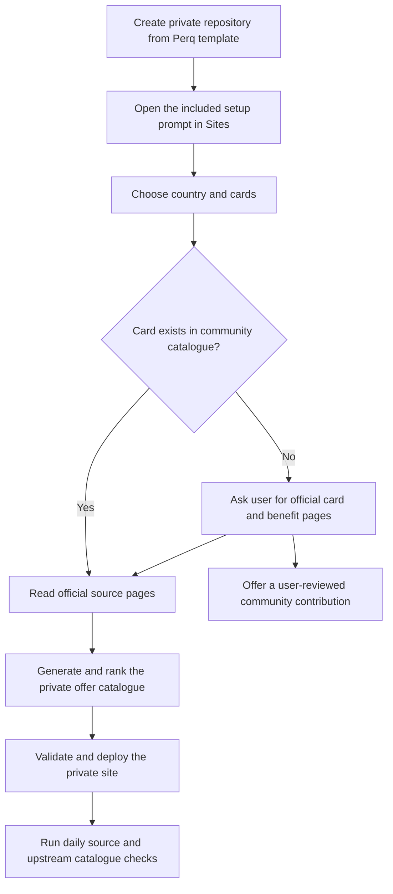

# Perq Open-Source Template Requirements

## Summary

Perq will become a prompt-driven GitHub Template that creates a private, personalized credit-card offer tracker. The public project will maintain reusable card and official-source information, while each user’s private copy extracts, ranks, refreshes and deploys its own offers.

---

## Problem Frame

Credit-card benefits are spread across issuer pages, campaign pages, PDFs, merchant terms and login-gated portals. A cardholder must repeatedly find the same sources, translate complex terms, notice expirations and decide which benefit matters now. The current Perq site proves that a ranked personal tracker is useful, but it is tied to one India-based wallet and currently requires repository knowledge to customize.

Publishing a central database of extracted offers would create a permanent freshness and moderation burden. Publishing each user’s selected cards would also expose personal wallet information because ordinary forks of public repositories are public. The open-source shape therefore needs to preserve a working example, make private personalization approachable through Sites, and allow the community to share durable source discovery without centralizing everyone’s generated offer data.

The prose requirements below govern if this diagram and the detailed behavior ever differ.

---

## Actors

- A1. Template user: creates and owns a private personalized tracker for their cards.
- A2. Sites agent: guides setup, source discovery, customization, validation, deployment and recurring refresh.
- A3. Catalogue contributor: proposes a missing card or corrected official source for the public catalogue.
- A4. Catalogue maintainer: reviews contributions for official-source quality and safe scope.

---

## Key Flows

- F1. Create a private tracker
  - **Trigger:** A1 creates a private repository from the public Perq template.
  - **Actors:** A1, A2
  - **Steps:** A2 presents the working India demo, asks for country and cards, looks up matching community entries, confirms the intended wallet, generates the private offer catalogue, validates it and guides private deployment.
  - **Outcome:** A1 has a working private tracker containing only their selected cards and generated offer data.
  - **Covered by:** R1, R2, R3, R5, R6, R7

- F2. Configure a card missing from the community catalogue
  - **Trigger:** A1 requests a card with no community entry.
  - **Actors:** A1, A2, A3
  - **Steps:** A2 asks for official issuer or program pages, validates that the sources are first-party, completes the private tracker without waiting for upstream inclusion, and offers to prepare a minimal catalogue contribution for A1 to review.
  - **Outcome:** Private setup succeeds; the missing card can optionally enter the public contribution flow.
  - **Covered by:** R8, R9, R10, R11

- F3. Refresh a private tracker
  - **Trigger:** The daily refresh runs or A1 requests a refresh.
  - **Actors:** A1, A2
  - **Steps:** A2 checks the canonical community catalogue for source changes, verifies the selected cards’ official pages, updates confirmed offer changes, archives confirmed expirations, validates the tracker and publishes only a successful refresh.
  - **Outcome:** The private tracker reflects confirmed current information, or reports a blocker without replacing trusted data with guesses.
  - **Covered by:** R12, R13, R14, R15

- F4. Improve the community catalogue
  - **Trigger:** A3 chooses to share a missing card or corrected source.
  - **Actors:** A3, A4
  - **Steps:** A3 submits only card identity and official source information; A4 verifies source authority, scope and duplication before accepting it.
  - **Outcome:** Future private trackers can discover the card or corrected source automatically.
  - **Covered by:** R4, R9, R10, R11

---

## Requirements

**Public template and first-run experience**

- R1. The public project must be usable as a GitHub Template that allows a user to create a private repository rather than requiring a public fork.
- R2. A new private copy must initially present the current India tracker as a clearly identified working example.
- R3. The project must include a primary Sites setup prompt that can guide a non-developer from the example tracker to their chosen country and cards.
- R4. The public project must include the canonical community catalogue consumed by private trackers.

**Community catalogue boundaries**

- R5. A community entry must describe a card’s identity, country, issuer and first-party official pages relevant to offers, benefits, memberships and reward programs.
- R6. The community catalogue must not act as the canonical store for extracted offers, simplified summaries, rankings, expiry state or a user’s selected wallet.
- R7. Generated offers, rankings and selected-card configuration must belong to the user’s private copy.
- R8. The setup flow must allow a missing card to be configured privately from user-supplied official sources without waiting for a community contribution to merge.

**Contribution workflow**

- R9. After privately configuring a missing card, Sites must offer to prepare a minimal community-catalogue contribution.
- R10. A contribution must contain only reusable card metadata and first-party official source information.
- R11. The user must review and explicitly approve a contribution before it is submitted; contribution is optional and cannot block private setup.

**Refresh and trust behavior**

- R12. Each private tracker must support an automated daily refresh that checks both the canonical community catalogue and the selected cards’ official sources.
- R13. Upstream catalogue changes must be used to discover new or corrected official pages without importing another user’s generated offers.
- R14. Refreshes must update only confirmed changes, retain archival history for confirmed expirations, and preserve existing trusted data when sources are unavailable, ambiguous or login-gated.
- R15. A refresh must be validated before publication; a failed validation or incomplete high-confidence check must produce a clear report instead of silently publishing guessed or partial data.

**Extensibility**

- R16. The catalogue must support incremental addition of countries, issuers and cards without requiring exhaustive global coverage for the first release.
- R17. The initial open-source release must preserve the useful product behavior demonstrated by the India example: card selection, ranked Offers/Card benefits/Memberships views, categories, expiry handling, saved items and official-source links.

---

## Acceptance Examples

- AE1. **Covers R1, R2, R3, R7.** Given a user creates a private repository from the template, when they open the setup prompt and select a different country and wallet, the resulting tracker replaces the example selection without publishing the user’s wallet to the public Perq project.
- AE2. **Covers R5, R6, R10.** Given a community entry for a card, when another user inspects it, they find reusable card identity and first-party source pages but no extracted offer inventory or personal selection data.
- AE3. **Covers R8, R9, R11.** Given a requested card is missing, when the user supplies valid official sources, their private setup completes and Sites offers—but does not automatically submit—a catalogue contribution.
- AE4. **Covers R12, R13.** Given a maintainer adds a newly discovered official benefits page to the canonical catalogue, when a private tracker’s next daily refresh runs, it checks that page for relevant offers without importing offer data from the public repository.
- AE5. **Covers R14, R15.** Given an issuer page is unavailable or its terms are ambiguous, when refresh runs, it preserves the last trusted entries, reports the source problem and avoids publishing speculative changes.
- AE6. **Covers R14.** Given an offer’s end date is confirmed by an official source, when that date passes, the private tracker retains the entry in Archive rather than deleting its history.

---

## Success Criteria

- A non-developer can create a private copy, provide a country and card list, and reach a useful personalized tracker primarily through the included Sites prompt.
- The public repository remains safe to share because it contains reusable source discovery and a working demo, not users’ private wallets or a centrally maintained extracted-offer database.
- A missing card does not block personal setup, and contributing it back is a short, optional, reviewable step.
- A private tracker automatically benefits from corrected or expanded upstream source information during daily refresh.
- Source failures fail closed: users can distinguish successfully refreshed data from stale, ambiguous or unverified information.
- Planning can proceed without inventing the product’s onboarding, privacy boundary, catalogue purpose, contribution flow or refresh behavior.

---

## Scope Boundaries

### Deferred for later

- Broader country and card coverage beyond the initial India example and community contributions.
- More sophisticated contributor reputation, catalogue health reporting or automated source-quality checks.
- Additional deployment targets and setup prompts beyond the initial Sites-first experience.
- Optional migration helpers for users who begin with a public fork instead of the recommended private template copy.

### Outside this product’s identity

- A centrally operated Perq SaaS product.
- User accounts, shared wallets or multiple users within one deployment.
- A canonical public database of extracted offers, rankings or personalized eligibility.
- Automatic community submissions without explicit contributor review.
- Storing card numbers, credentials or login-protected personalized offer contents.
- Guaranteeing complete global card coverage.

---

## Key Decisions

- Prompt-driven template rather than developer starter: personalization should be guided through Sites instead of requiring code edits as the primary path.
- Private template copy rather than public fork: a user’s selected wallet and generated data should not become public by default.
- Working India example rather than blank state: users can inspect a useful product before replacing the example configuration.
- Source registry rather than offer database: official-page discovery is durable and shareable; extracted offer state remains private and refreshable.
- Setup must not depend on contribution: users receive value immediately, while the community loop remains optional.
- Automatic upstream check during daily refresh: private trackers benefit from community maintenance without a manual resync ritual.
- Human-approved contributions: Sites can prepare the change, but the contributor retains control over submission.

---

## Dependencies / Assumptions

- Users can create a private repository from the public GitHub Template and grant Sites sufficient access to customize it.
- Official issuer and program pages remain the authority; some sources will be unavailable, dynamic or login-gated and must fail closed.
- The public catalogue’s maintainers can enforce a first-party-source-only contribution policy.
- An OSI-approved license must be selected before positioning the repository as an open-source release.
- The public example data contains no card numbers, credentials or login-protected personalized offer contents.

---

## Outstanding Questions

### Deferred to Planning

- [Affects R1, R3][Needs research] What exact GitHub Template and Sites handoff gives a non-developer the shortest reliable private-repository setup?
- [Affects R4, R12, R13][Technical] How should private copies consume canonical catalogue updates without coupling generated personal data to upstream code changes?
- [Affects R3, R12][Technical] How should the setup prompt create or guide the recurring refresh across supported environments?
- [Affects R14, R15][Needs research] What source-access, copyright, robots and issuer-terms constraints must the refresh guidance respect?
- [Affects public launch][User decision] Which OSI-approved license should govern the project? MIT is the default recommendation for a permissive template.
